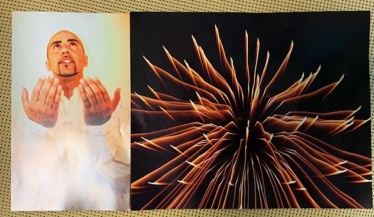

# Anita Martin - Project Development

## My Links

Click [Updated R&eacute;sum&eacute; 06/14/2019](ResumeEdited06042019.pdf) for work history.

Click <a href= "https://www.linkedin.com/in/anita-martin-84bb78183/"> here <a/> for my LinkIn Page.

Click [here](bio.md) to learn how I got here.

## Weekly Reflections
 - What did I learn this week?
 - What I felt like an accomplishment?
 - How have I grown from this expereince?
 - How has my perception changed?
 - Why do I love coding?
  
  - Week 3 & 4
    
WHOA! is all I have to say for weeks 3 and 4. We had our very first exam and boy-oh-boy was that intense! At the beginnig of week 4 I was not prepared but after I met with my tutor Rebecca I felt a little accomplished. It was good to hear that the normal jitters and the brain overloading was normal. She was great and I am scheduling more sessions with her this week. On Wednesday the quiz was good. I was able to retake it and got a passing grade so that was great! The written part for Exam #1 came out better that I expected hahaha. I was proud of myself. The Exam #1 part #2 I struggled with. I went in early to get a head start on it. The first question was ok I was able to complete that. As I progressed along it was getting harder and harder. I had to take a few extra breaks. Again I feel like I should know this by now! and I start getting frustrated. I hoped to have accomplished more but I did not. After a day off from everything I know that I have to do more. I know that I need more practice in the coding part so my goal for the next week or so is to go through as much of the coding bat exercises as I can. Coding is still a love/hate relationship, at the end of this week it was more of a hate thing hahaha.
    
  
  - Week 1 & 2
    
I had started classes on May 20th, 2019 and its been exactly 13 days. My brain has never been so pumped up, overloaded, excited, and stressed out all at once. LOL The first week was pretty hectic learning and cramming all the tools we need to start a project on our own. I am for the most part understanding it, but I feel like its not enough. I try to do some extra readings and doing the exercises in the book but I get hung up on one problem and I end up spending too much time on it and I forget about everything else. I am learning but its a slow process for me. As I take some extra time on the readings, watching youTube clips, and lots of websearching, it is definatly helping me out. So far what I have accomplished is learning the basics of programming. Learning the shortcuts and proper structure is what I want to focus on, and of course learning the coding itself. I would like a tutor to help speed up this pcocess if I can. My preception changed this week after talking with Karen that this whole process will take time for ME. I just need to focus on some of the postitive as well. Before I was really putting myself down as I would see my other classmates catching on to things faster than I, so I felt a little out of place for a while. Why do I love coding? So far I love it because this is something I have wanted to do forever and I am actually to do this! Although its a love-hate relationship I am not going to give up anytime soon.

  

## Pro Dev Activities

### Identity Chart

| Identify Chart| Professional  | Personal     |
| ------------- | ------------- | -------------|
| <strong>Identity:</strong>     | Anita Martin  | Callisto-Painite|
| <strong>Channels:</strong>     | LinkedIn, GitHub, Instagram, Twitter | Facebook, Snapchat |
| <strong>Content:</strong>      |Work Experience, Developer, School, Accomplishment |Family Ties, Mean memes, Art/photography, HS Connections|

### Visual Speaks

The first picture symbolizes hope and prayer and it best represents where I am at in this point of my life. Right now changing career paths stepping into something totally different is a very scary process. So I send my prayers to a higher power to help guide me through the next phase of my life. On top of that: daily studying, re-reading chapters, and extra research helps with the process of understanding everything. All I can say is that I "hope and pray" that this will be enough to finish off this bootcamp.

 The second picture show where I will be at in three years. I picked the glowing fireworks because I see myself glowing with a company that appreciates my work and skills. I want to be accomplishing something great.

### Who am I?
 
 I am a Java/ Android Developer taking and internship with the Deep Dive Coding Bootcamp( I am working with Hope Technologies)

 
 I attended my first 1 Million Cups event and that was so great! Me and my career buddy Jeff Franklin made some awesome connections and we both motivated each other at the same time. It was a great event. I got 3 business cards #1 Sarah Mcord, she was selling some of her art work and she was a great person to talk too. #2 Deidre Grabke She overheard my converstions with Denelle about making some business cards for myself and she recommeded the place she got hers done. We chit-chatted for a while and I told her who I was and gave my line of " My name is Anita Martin I am a future Software Programmer and currently taking a Deep Dive Bootcamp" #3 David? did not get his last name. Funny story I was walking near the front and I tripped on the microphone and he ask if I was ok. "Way to go Anita!" I thought but that was my first connections so it made my first connection memorable. Overall the event was fantastic I also made another career buddy, Janal Sanchez from the Digital Media bootcamp. Making those connections for sure!

### Quanititive Accomplishments
   - Working at DISH I oversaw just under one Million dollars of inventory. I had to track it, order it, ship it out mainly watch our shrink on it.
   - I was also in charge of overseeing about 70-90 technicians’ individual inventory. We had to replenish every week to make sure they did not run out of equipment for installs.
   - We had about 90 vehicles in our fleet so I had to maintain the maintacnce on them. From oil changes, brake changes, windshield replacements, etc..

### Qualitative Accomplishment
   - Great communicator – I have a great communications skills through emails, phone etiquette, and face-to-face. Large groups usually more than 20 I start to panic a little. 
   - Organizer - I am a great organizer, as I have eveything that I need to do in my calender. What I was taught was "Make time for it or you won't get to it."
   - People person - I have a belief that we are our own individual person and that makes us unique. So I like to talk to people, even though I know I come across as shy or in my own zone, once I start to warm up to people I like to have conversations about everything.
    
### What do I bring to the table?

Warehouse Inventory process – knew the ends and outs of the process of inventory related tasks.
Great with people – I had about at 70 to 90 techs that I was working with to track inventory on a weekly schedule. Used email, phone and person-to-person interactions.Great under pressure – working with deadlines when projects were pushed on to me. Had a time frame of due by the end of the day or a month.Well organized – kept our warehouse organized so that we can easily pull items quickly and efficiently.
Excel was my friend – I had to work on a daily basis with excel building models to help track inventory, building schedules to help keep track of things that were completed and not completed.Hard worker – all the positions that I held I started off from the very bottom and worked my way to a management position.

    
### Whole Brain Accomplishment

My passion product now is building small furniture out of pallets. The way this get incorporated with using my whole brain is being creative as to what I want to build. The other side is making sure that I construct it correctly. Measurements match up.

    
    
### Golden Circle
 - Why?
   -The main reason behind what I am on this path is to better my life and my family. To help those around me.
   - How?
     -Coding skills
     -College Degree Bachelor’s Degree 
   -What?
     -Deep Diving Bootcamp
     -Previous work skills
    
### Elevator Pitch
 * Name? What? Why? How? Ask?
   *My name is Anita Martin I am currently a student with CNMStemuLUS learning about coding. What drove me to this decision is to better myself and my family. Learning coding will help me about today’s advancing technology.
 * Edited Version
   * My name is Anita Martin, I am from the Dine Nation and currently a student in the JAVA+Android Bootcamp with CNMStemuLUS, learning about computer programming. I have a passion for helping people, more so helping my Dine people. I want to change the technology on the reservation to make things more modern for us, at the same time keeping our traditions alive. I want to bring my knowledge of what I learn and weave that into our society. Would you like to help change some lives?
